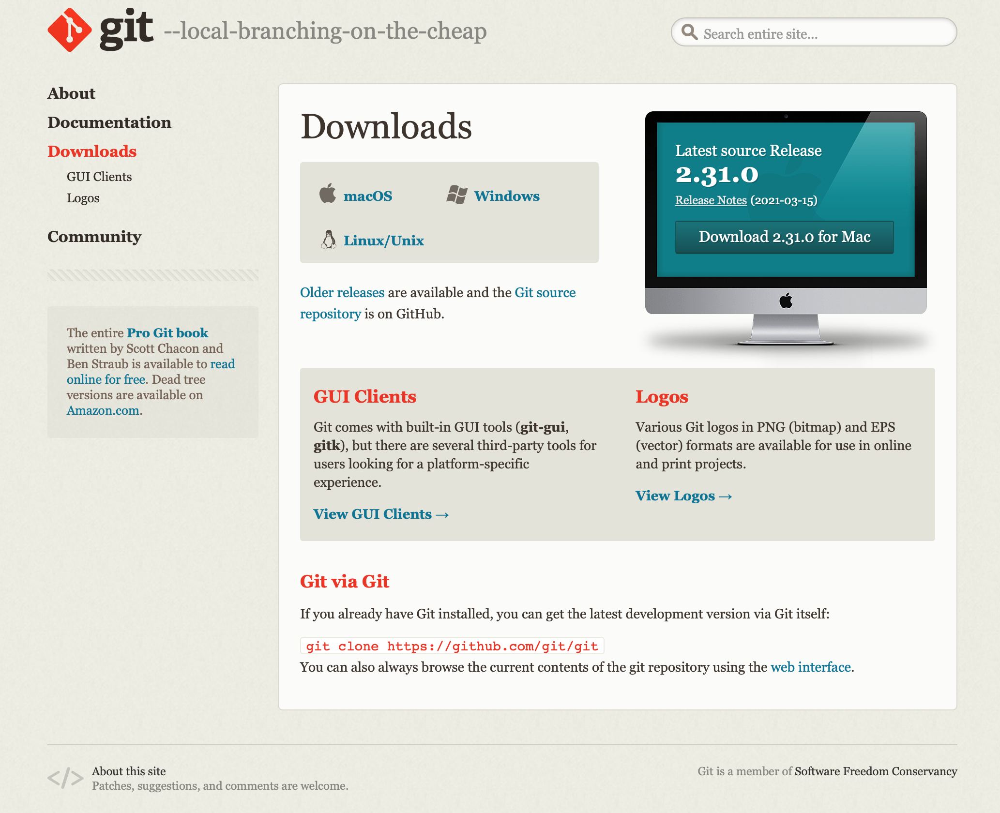
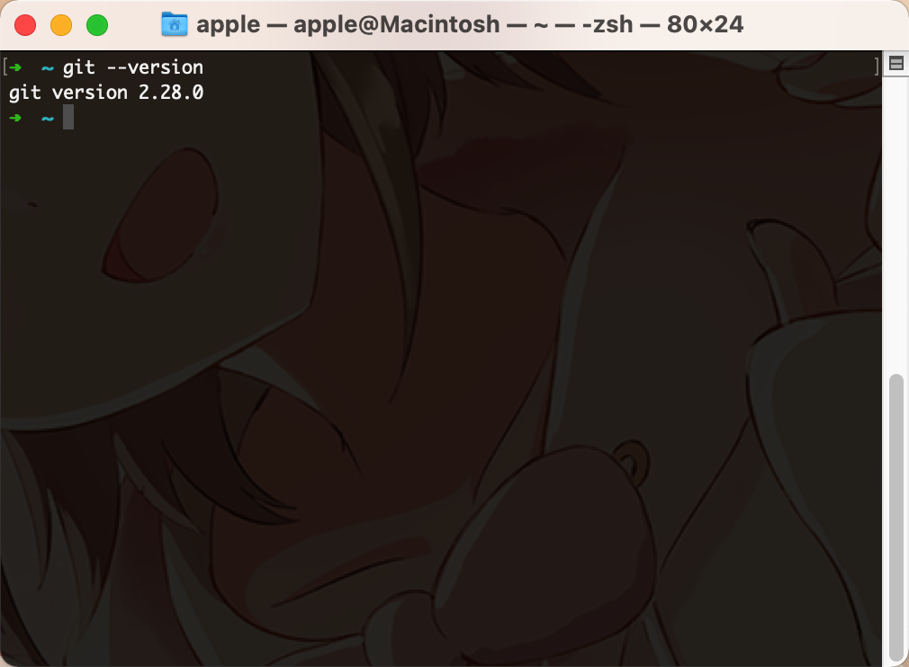
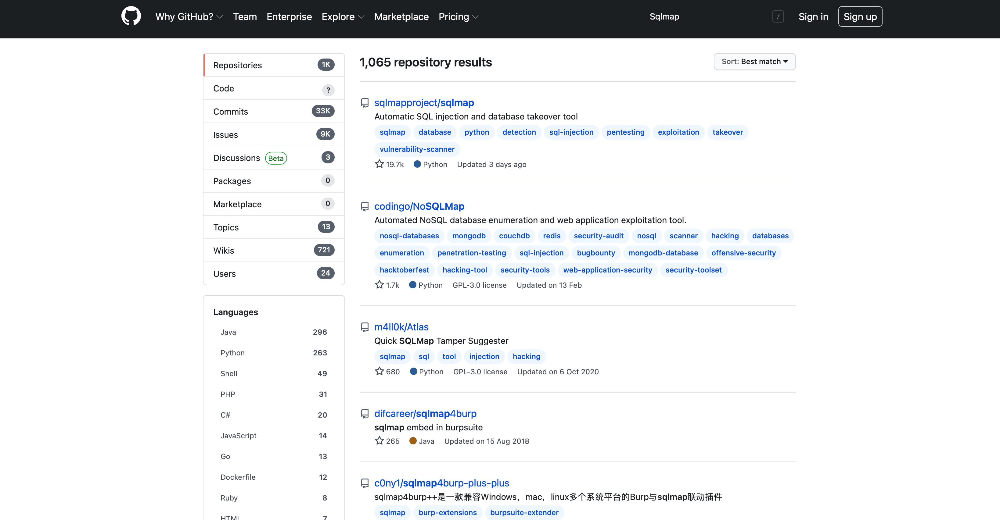
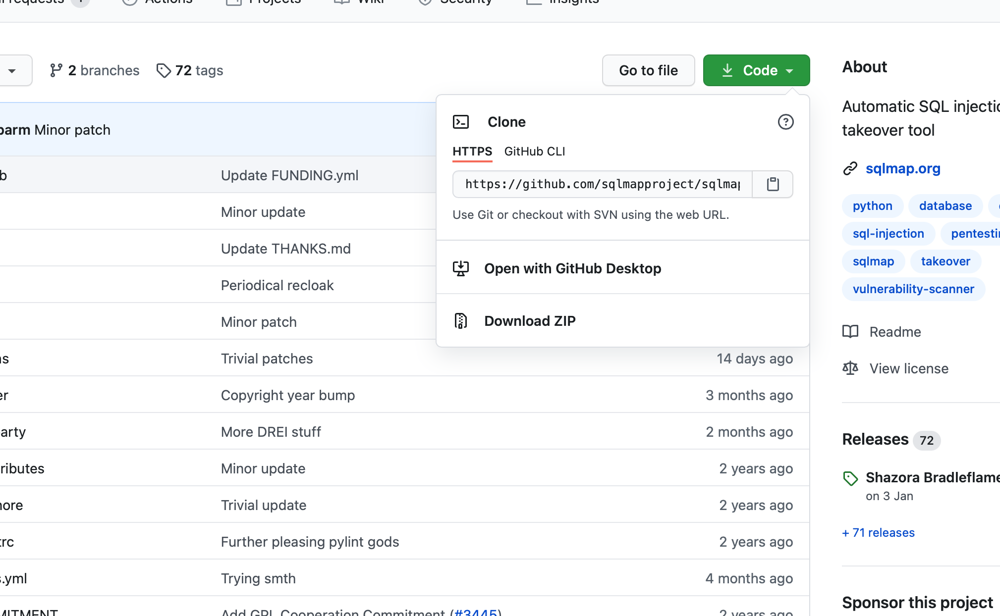
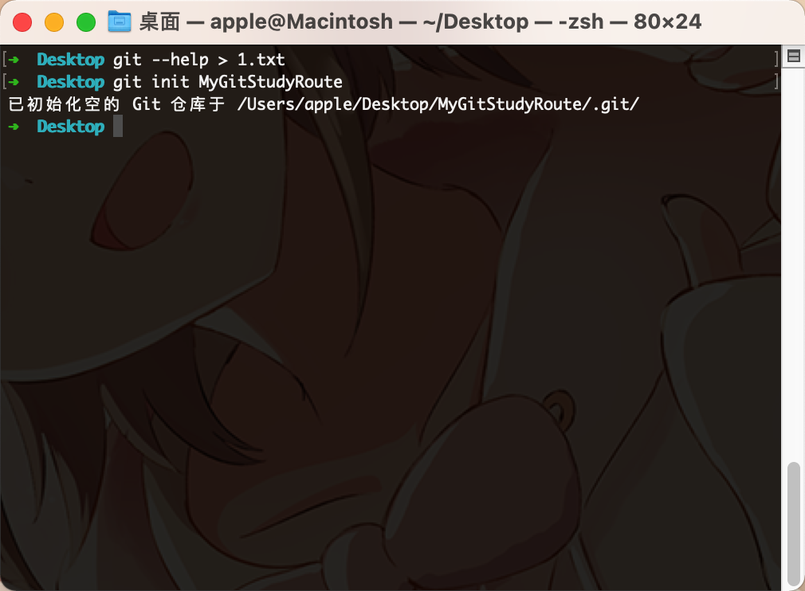
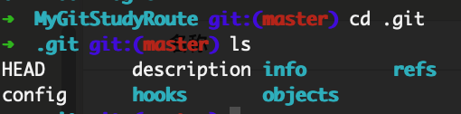
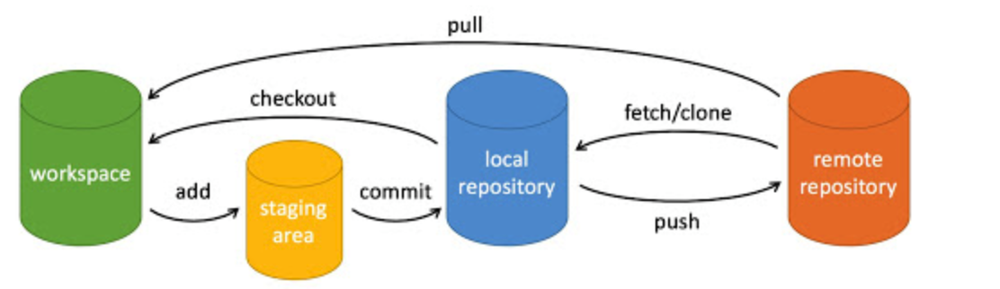
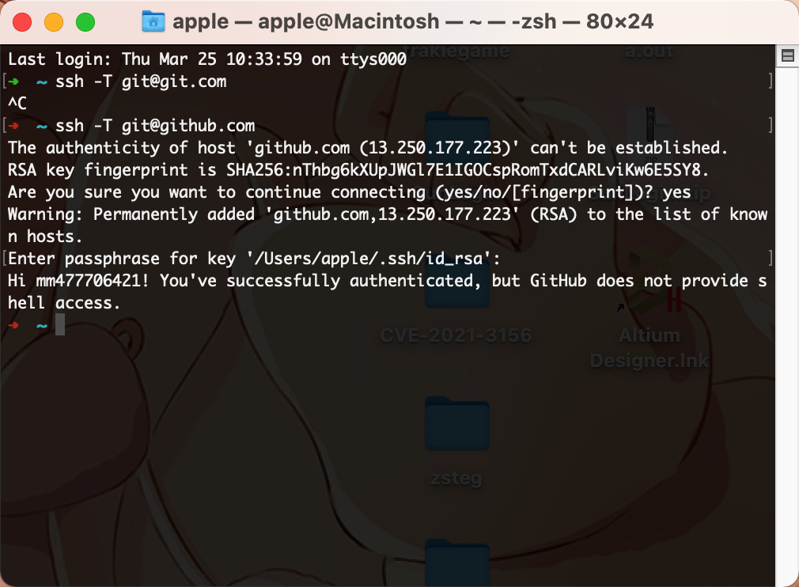

# Git使用记录

## Git介绍

Git是世界上最为先进的代码版本管理系统，我们能够通过Git这个软件去将软件开发的源代码或者是工程去放置在我们所需要的代码仓库中。Git于2005年发布，从2005年7月11日到2020年2月27日已经陆续经历了几十个版本的更新，目前最新的版本是2.30.2，在上述描述中，我们只介绍了Git作为软件版本发布系统，但是在如今，随着开源世界的发展，Git被越来愈多的人获取开源代码。Git的存在大大加强了开源观念的发展。

## Git在不同操作系统上的安装

Git是一个跨各大操作系统都是有发布版本的，对于各大系统的安装方法也是大同小异。这里我们介绍一下三大主流系统安装git的方法

### Windows

在Windows上安装git是十分简单的，我们只需要找到git的官方网站，[Git](https://git-scm.com)<----这里是Git的官方网站



我们只需要选择Windows版本的git进行下载安装即可，在安装的时候，我们需要注意选择增加Git到Path全局变量中。这样我们就能够使用命令提示符去使用git命令了

### Linux

Linux安装git比较简单，我们只需要打开Linux发行版的bash，如果是使用apt软件管理器的话，我们只需要输入一个命令

```bash
sudo apt update & sudo apt install git
```

稍等片刻～即可成功安装git

### macOS

我们同样是打开shell，我们如果安装了brew软件管理器的话，我们就可以直接的输入brew install git即可进行安装，亦或是我们直接在shell中输入git，如果我们的Mac并没有安装git的话，我们的电脑会提示你需要安装Xcode- developer tools，我们对其进行安装就可以了。


## Git的使用

我们首先可以验证Git是否成功安装，我们可以在shell中输入

```bash
git --version
```

就可以看到如下的界面，显示的就是git的软件版本



我们继续输入`git --help`可以直接查看git的相关帮助

```elm
用法：git [--version] [--help] [-C <路径>] [-c <名称>=<取值>]
           [--exec-path[=<路径>]] [--html-path] [--man-path] [--info-path]
           [-p | --paginate | -P | --no-pager] [--no-replace-objects] [--bare]
           [--git-dir=<路径>] [--work-tree=<路径>] [--namespace=<名称>]
           <命令> [<参数>]

这些是各种场合常见的 Git 命令：

开始一个工作区（参见：git help tutorial）
   clone             克隆仓库到一个新目录
   init              创建一个空的 Git 仓库或重新初始化一个已存在的仓库

在当前变更上工作（参见：git help everyday）
   add               添加文件内容至索引
   mv                移动或重命名一个文件、目录或符号链接
   restore           恢复工作区文件
   rm                从工作区和索引中删除文件
   sparse-checkout   初始化及修改稀疏检出

检查历史和状态（参见：git help revisions）
   bisect            通过二分查找定位引入 bug 的提交
   diff              显示提交之间、提交和工作区之间等的差异
   grep              输出和模式匹配的行
   log               显示提交日志
   show              显示各种类型的对象
   status            显示工作区状态

扩展、标记和调校您的历史记录
   branch            列出、创建或删除分支
   commit            记录变更到仓库
   merge             合并两个或更多开发历史
   rebase            在另一个分支上重新应用提交
   reset             重置当前 HEAD 到指定状态
   switch            切换分支
   tag               创建、列出、删除或校验一个 GPG 签名的标签对象

协同（参见：git help workflows）
   fetch             从另外一个仓库下载对象和引用
   pull              获取并整合另外的仓库或一个本地分支
   push              更新远程引用和相关的对象

命令 'git help -a' 和 'git help -g' 显示可用的子命令和一些概念帮助。
查看 'git help <命令>' 或 'git help <概念>' 以获取给定子命令或概念的
帮助。
有关系统的概述，查看 'git help git'。

```

### Git的克隆

Git的克隆是最常用到的一个命令，我们常常从代码开源库中使用git命令去进行克隆一些代码或者是项目，世界上有几个比较大的托管代码仓库的地方：

1、**GitHub** 全世界最大的开源代管托管管理仓库，拥有世界上最为强大的代码管理系统

2、**GitLab** GitLab 与 GitHub 功能几乎相同，有些人甚至可能会说它的持续集成和测试工具更优越。

3、**Bitbucket** 具有 GitHub 和 GitLab 上的大部分功能，以及它自己的一些新功能

4、**SourceForge** 开源代码仓库的鼻祖

我们以GitHub为例，比如说我们想要克隆一个项目，我们只需要打开[GitHub](www.github.com)官方网站


然后在左上角进行搜索搜索你所需要的项目，然后复制其地址

就像如下图所示的，找到其地址，这里我们以SqlMap项目为例，找到其项目地址为`https://github.com/sqlmapproject/sqlmap.git`



我们在shell中进入到我们想要保存项目的目录中，输入

```bash
git clone https://github.com/sqlmapproject/sqlmap.git
```

稍等片刻，我们就可以将Sqlmap项目成功的克隆下来了，之后我们就可以对这个项目进行相应的使用了

git clone 时，可以所用不同的协议，包括 ssh, git, https 等，其中最常用的是 ssh，因为速度较快，还可以配置公钥免输入密码。各种写法如下：

```bash
git clone git@github.com:fsliurujie/test.git         --SSH协议
git clone git://github.com/fsliurujie/test.git          --GIT协议
git clone https://github.com/fsliurujie/test.git      --HTTPS协议
```


### Git的仓库创建

我们在使用clone时是对已有的仓库进行一个下载，我们现在想要使用git把我们自己的代码上传到仓库中的话，我们就需要拥有我们自己的代码仓库，但是该如何做呢？

我们在git的帮助目录中可以看到git是有一条命令`git init`是可以创建一个属于自己的本地目录的。

在执行完成 `git init` 命令后，Git 仓库会生成一个 .git 目录，该目录包含了资源的所有元数据，其他的项目目录保持不变。

举个例子，我们接下来创建一个属于自己的Git学习路线仓库

我们在shell中输入如下的命令

```bash
git init MyGitStudyRoute
```



这里可以看到它提示了你将你的仓库创建到了哪个目录当中，这里可以看到我们生成的目录


刚创建好的Git目录是一个空目录

但是我们使用shell去进行查看这个目录下的文件输入`cd MyGitStudyRoute; ls -a`

我们可以看到这个目录下其实是有一个叫做`.git`的目录，这个目录下面



是有如上图所示的一些文件的，所有 Git 需要的数据和资源都存放在这个目录中。

### Git的配置

Git提供了针对本地仓库进行配置亦或是针对全局进行设置的选项

我们可以使用`git config --list`去进行查看git的相关配置，增加`-e`选项可以进行配置的编辑。增加`--global`选项可以对全局的配置进行更新

例如，我们再下来就要进行对于git 用户名和邮箱的配置

```bash
git config --global user.name "mm477706421"          --配置用户名
git config --global user.email 477706421@qq.com      --配置邮箱
```


### Git的基本操作

Git 常用的是以下 6 个命令：**git clone**、**git push**、**git add** 、**git commit**、**git pull**。

我们在上述的文档中已经介绍过了第一个`git clone`这个命令，是用来对已有的项目仓库进行克隆的命令，我们接下来来看一下接下来的这几个命令都是做什么用途的。

#### Git原理

在看用途之前，我们首先需要了解一下git的工作原理。



这张图片很好的显示出了git的工作流程，首先我们先看一下各个部分

##### local repository

本地仓库，也就是我们自己的开发环境在本地项目下搭建的项目仓库，也叫做版本库

##### workspace

工作区，是我们真正开发代码的地方

##### staging area

缓存空间，就是我们在成功的开发出了新版本的项目之后，我们可以将项目工程暂时的存储在缓存区中，这一部分的代码会等待将其真正的发布到本地仓库中。

##### remote repository

远程仓库，如GitHub一类的代码托管仓库

我们先将文件add到缓存区，然后提交到本地仓库中，我们可以把仓库中的文件传回工作区进行再一次的复核，当复核结束之后，我们就可以将本地的仓库push到远程托管仓库中，当需要使用到仓库的时候，我们可以直接使用clone进行克隆仓库到本地仓库中。

#### git add

这里我们举个例子：我们创建一个README文件和HelloWorld.py文件然后添加到我们的仓库中

```bash
touch README
echo "print(/"HelloWorld/")" > HelloWorld.py
git status -s
?? README
?? hello.php //查看文件的状态

git add .//增加本文件夹下所有文件到缓存区

git status -s
A  README
A  hello.php //由??变成了A表示已经增加到了缓存区中

//现在我们修改 README 文件：
nano README
git status -s
AM README
A  hello.php //AM 状态的意思是这个文件在我们将它添加到缓存之后又有改动。改动后我们再执行 git add . 命令将其添加到缓存中：
```

件修改后，我们一般都需要进行 git add 操作，从而保存历史版本。

#### git push

命令格式如下：

```bash
git push <远程主机名> <本地分支名>:<远程分支名>
```

**git push** 命用于从将本地的分支版本上传到远程并合并。


以我的 https://github.com/mm477706421/MyGitStudyRoute 为例，本地添加文件：

```
$ touch Test.txt      # 添加文件
$ git add Test.txt 
$ git commit -m "添加到远程"
master 69e702d] 添加到远程
 1 file changed, 0 insertions(+), 0 deletions(-)
 create mode 100644 runoob-test.txt

$ git push origin master    # 推送到 Github
```

将本地的 master 分支推送到 origin 主机的 master 分支。

重新回到我们的 Github 仓库，可以看到文件已经提交上来了：

#### git commit

git commit 命令将暂存区内容添加到本地仓库中。

提交暂存区到本地仓库中:

```bash
git commit -m [message]
```

[message] 可以是一些备注信息。

开始前我们需要先设置提交的用户信息，包括用户名和邮箱：

```bash
$ git config --global user.name 'runoob'
$ git config --global user.email test@runoob.com
```

接下来我们就可以对 hello.php 的所有改动从暂存区内容添加到本地仓库中。

以下实例，我们使用 -m 选项以在命令行中提供提交注释。

```bash
$ git add hello.php
$ git status -s
A  README
A  hello.php
$ git commit -m '第一次版本提交'
[master (root-commit) d32cf1f] 第一次版本提交
 2 files changed, 4 insertions(+)
 create mode 100644 README
 create mode 100644 hello.php
```

现在我们已经记录了快照。如果我们再执行 git status:

```bash
$ git status
# On branch master
nothing to commit (working directory clean)
```

#### git pull

**git pull** 命令用于从远程获取代码并合并本地的版本。 

**git pull** 其实就是 **git fetch** 和 **git merge FETCH_HEAD** 的简写。 命令格式如下：

```bash
git pull <远程主机名> <远程分支名>:<本地分支名>
```

将远程主机 origin 的 master 分支拉取过来，与本地的 brantest 分支合并。

```
git pull origin master:brantest
```

如果远程分支是与当前分支合并，则冒号后面的部分可以省略。

```bash
git pull origin master
```

### Git远程操作（GitHub为例）

我们想要将我们自己的本地仓库上传到Github上面的话，首先我们需要将Github对我们自己的账户进行一个认证，我们认证之后就可以对自己的远程托管仓库进行上传和合并，接下来我们讲述一下如何对远程仓库进行相应的配置

首先在本地创建`ssh key；`

```bash
$ ssh-keygen -t rsa -C "your_email@youremail.com"
```

后面的`your_email@youremail.com`改为你在github上注册的邮箱，之后会要求确认路径和输入密码，我们这使用默认的一路回车就行。成功的话会在`~/`下生成`.ssh`文件夹，进去，打开`id_rsa.pub`，复制里面的`key`。

回到github上，进入 Account Settings（账户配置），左边选择SSH Keys，Add SSH Key,title随便填，粘贴在你电脑上生成的key。


为了验证是否成功，在git bash下输入：

```bash
$ ssh -T git@github.com
```



如果是第一次的会提示是否continue，输入yes就会看到：You've successfully authenticated, but GitHub does not provide shell access 。这就表示已成功连上github。

接下来我们要做的就是把本地仓库传到github上去，在此之前还需要设置username和email，因为github每次commit都会记录他们。

```bash
$ git config --global user.name "your name"
$ git config --global user.email "your_email@youremail.com"
```

进入要上传的仓库，右键git bash，添加远程地址：

```bash
$ git remote add origin git@github.com:yourName/yourRepo.git
```

后面的yourName和yourRepo表示你再github的用户名和刚才新建的仓库，加完之后进入.git，打开config，这里会多出一个remote "origin"内容，这就是刚才添加的远程地址，也可以直接修改config来配置远程地址。

创建新文件夹，打开，然后执行` git init` 以创建新的 git 仓库。

这时候我们的GitHub远程仓库就已经创建完成了，现在我们就可以上传我们的项目到GitHub上了

